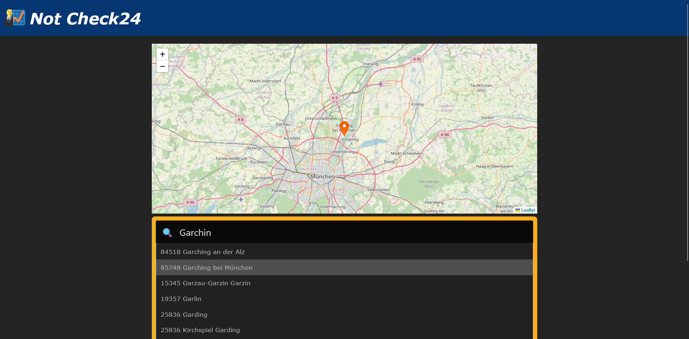
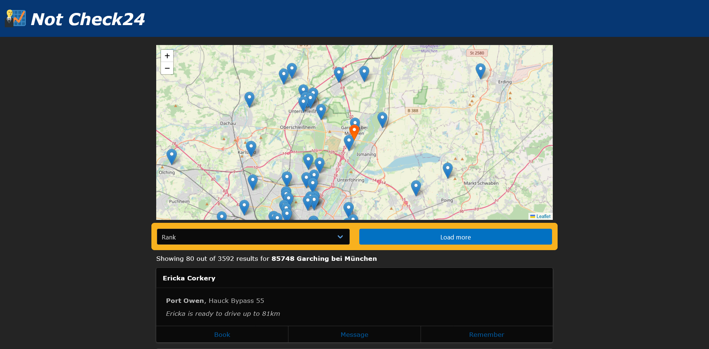

# y-stonker
This repository contains the code of [our submission](https://devpost.com/software/y-stonker) for the Check24 challenge at [hackaTUM 2023](https://hack.tum.de). Our project won first place of the challenge.

Details on the challenge can be found [here](https://github.com/check24-profis/hackatum-2023).

This demonstration GIF shows how our site works:

### Screenshots

### Run it yourself
You can run this project using Docker Compose:

    git clone https://github.com/thomasw04/hackaTUM23 && cd hackaTUM23

Then run the servers:

    docker compose up

If everything worked, you can visit http://localhost in your browser.
